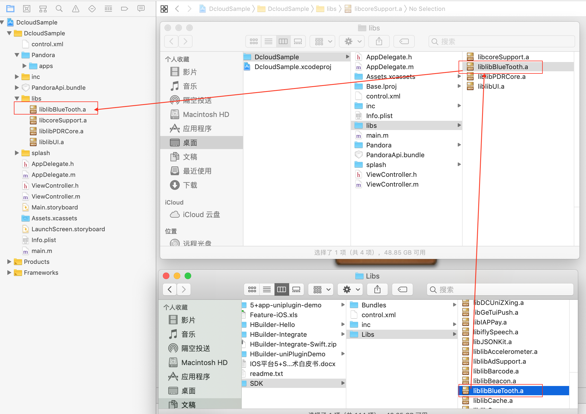
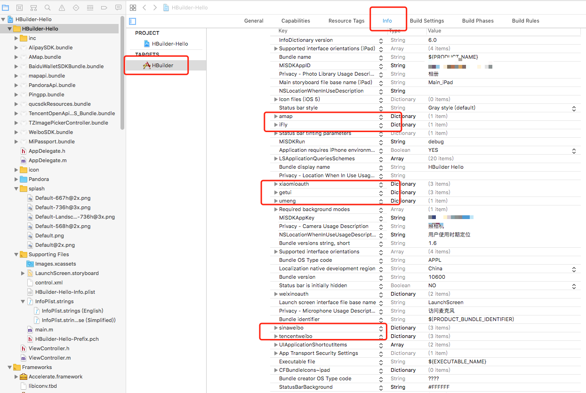
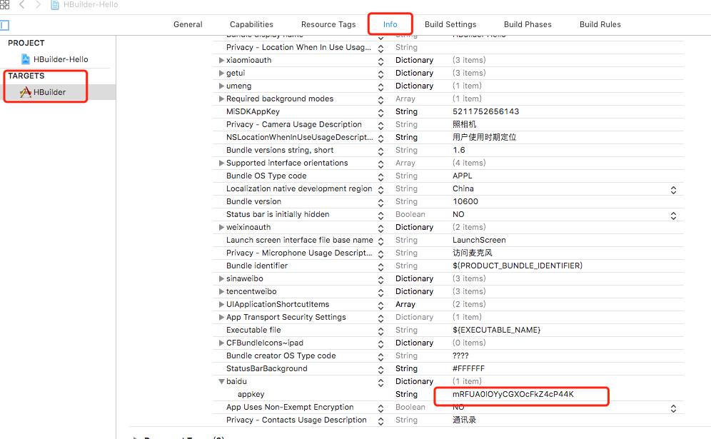
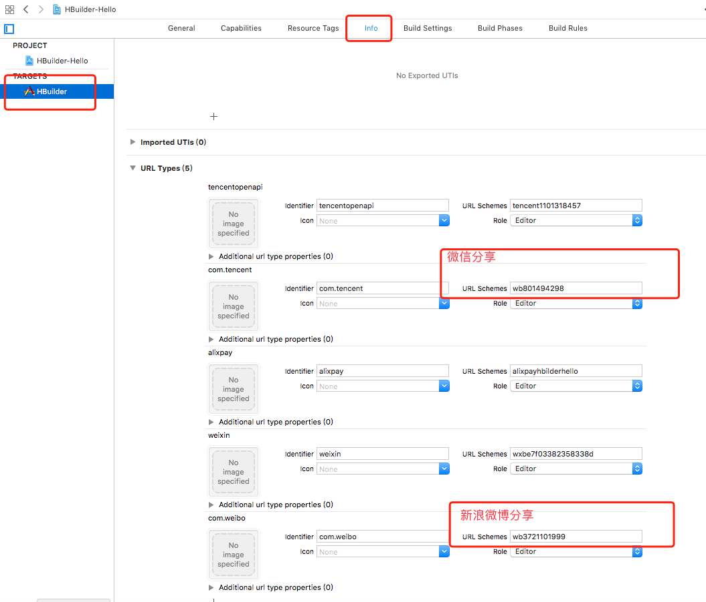

## 配置应用需要用的功能模块
### 比如需要配置蓝牙模块
1、打开“Feature-iOS.xls”文件，查看模块的配置要求，如下图：

2、在离线SDK包里，IOSSDK/SDK/Libs目录下找到需要的库文件，然后把找到的liblibBlueTooth.a库拷贝到工程的libs目录下，再根据配置要求把相关的库引入到工程中，如下图：

## 配置第三方库的参数
有些功能模块（如推送、分享、语音识别、统计），则需要通过“Feature-iOS.xls”文件中查找对应模块的“Info”值，并在工程属性界面“Info”下“Custom iOS Target Properties”中配置对应的项：

如百度地图，需要配置在百度云平台申请应用的appkey，找到“baidu”项下的“appkey”，双击后输入正确的appkey值：

注意：新浪微博和微信分享还需要配置应用的URL Schemes，在“URL Types”项下分别输入在各开放平台申请的值：

[iOS10之后 需要在info.plist文件中添加隐私权限配置](http://ask.dcloud.net.cn/article/931)

## 配置完成编译运行
应用配置完毕，在模拟器或者真机上编译运行工程，运行成功并且功能没有缺失，说明配置成功。

## 文章
[iOS离线打包 - 模块通用配置](https://ask.dcloud.net.cn/docs/#//ask.dcloud.net.cn/article/168)

[iOS离线打包 - 语音识别(Speech)插件配置](https://ask.dcloud.net.cn/docs/#//ask.dcloud.net.cn/article/35358)

[iOS离线打包 - LivePusher直播推流插件配置](https://ask.dcloud.net.cn/docs/#//ask.dcloud.net.cn/article/35376)

[iOS离线打包 - 个推push和UniPush插件配置](https://ask.dcloud.net.cn/docs/#//ask.dcloud.net.cn/article/171)

[iOS离线打包 - 分享插件配置](https://ask.dcloud.net.cn/docs/#//ask.dcloud.net.cn/article/170)

[iOS离线打包 - 地图配置](https://ask.dcloud.net.cn/docs/#//ask.dcloud.net.cn/article/169)

[iOS离线打包 - 友盟统计配置](https://ask.dcloud.net.cn/docs/#//ask.dcloud.net.cn/article/229)

[iOS离线打包 - 支付插件配置](https://ask.dcloud.net.cn/docs/#//ask.dcloud.net.cn/article/246)

[iOS离线打包 - 第三方登录插件配置](https://ask.dcloud.net.cn/docs/#//ask.dcloud.net.cn/article/309)
